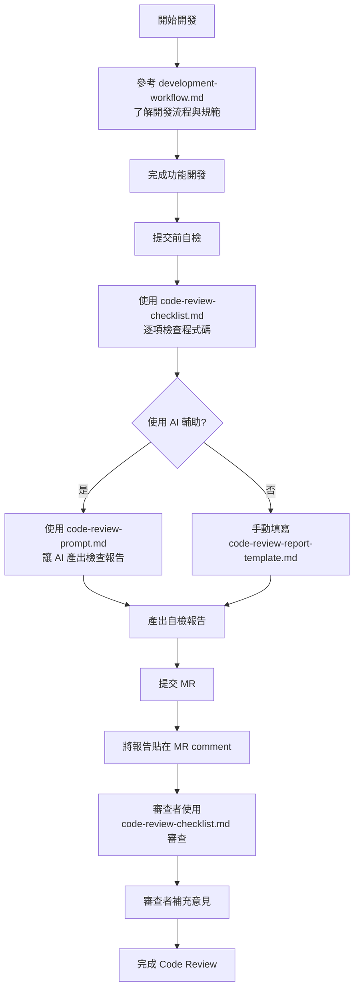

# 前端 Code Review Guideline

## 簡介

本 Guideline 提供前端團隊在進行 Code Review 時的標準化檢核流程與報告範本。基於內部專案 (ai-training-partner, ai-training-partner-admin) 的最佳實踐與資安規範整理而成，適用於 **Next.js + React + TypeScript + React Query** 技術棧。

透過統一的檢查項目與審查標準，達成以下目標：

- 確保程式碼品質與架構一致性
- 降低 Bug 與安全性風險
- 提升團隊協作效率與程式碼可維護性
- 建立可複製的 Code Review 流程
- 支援 AI 輔助審查，產出標準化報告

## 文件結構

```
frontend-development-guideline/
├── README.md                        # 本文件 - 使用說明
├── development-workflow.md          # 開發流程指南（從需求到 MR）
├── code-review-checklist.md         # Code Review 檢核清單
├── code-review-report-template.md   # 檢查報告大綱模板
└── code-review-prompt.md            # AI 審查專用 Prompt
```

### 文件使用指南

| 文件                             | 用途                                         | 使用階段             | 使用者                 |
| -------------------------------- | -------------------------------------------- | -------------------- | ---------------------- |
| `development-workflow.md`        | 完整開發流程、版控規範、衝突處理、CI/CD 說明 | 開發階段             | 新進開發者、所有開發者 |
| `code-review-checklist.md`       | 詳細的檢核項目與程式碼範例                   | 提交前自檢、審查階段 | 開發者、審查者         |
| `code-review-prompt.md`          | AI 審查工具專用 Prompt                       | 產出報告（AI）       | 開發者（自查）         |
| `code-review-report-template.md` | 標準化的檢查報告範本                         | 產出報告（手動）     | 開發者（自查）、審查者 |
| `README.md`（本文件）            | 了解所有文件的用途與使用方式                 | 整體指引             | 所有人                 |

## 完整 Code Review 流程

### 流程圖



> **註**：`code-review-prompt.md` 會自動引導 AI 參考 `code-review-checklist.md` 與 `code-review-report-template.md`，使用者無需額外處理。

---

## 使用流程

### 開發者（提交 MR 前）

**步驟 1：開發前準備**

- 閱讀 `development-workflow.md` 了解開發流程
- 確認需求與 PM 對齊

**步驟 2：開發階段**

- 依據 `development-workflow.md` 的步驟進行開發
- 遵循專案的版控與 Commit 規範

**步驟 3：提交前自檢**

- 開啟 `code-review-checklist.md` 了解檢核標準
- 逐項檢查自己的程式碼是否符合規範
- 執行必要的程式碼品質檢查（lint、type-check、build）

**步驟 4：產出自檢報告**

- **選項 A - 使用 AI 工具**：
  - 將 `code-review-prompt.md` 與 MR diff 提供給 AI 工具
  - AI 會依據檢核清單自動產出報告
- **選項 B - 手動填寫**：
  - 使用 `code-review-report-template.md` 作為範本
  - 手動填寫檢查結果

**步驟 5：提交 MR**

- 建立 Merge Request
- 將自檢報告貼在 MR 的 **comment** 區域（不是 description）
- 標註需要審查者特別關注的項目
- ⚠️ 不要將報告 commit 到版控中

### 審查者（Code Review 時）

**步驟 1：查閱開發者的自檢報告**

- 確認開發者已完成自查
- 了解重點關注項目與已知問題

**步驟 2：依據檢核清單審查**

- 參考 `code-review-checklist.md` 進行全面審查
- 重點審查：
  - 🔴 安全性問題（必須修正）
  - 🟡 架構設計與程式碼品質
  - 🟢 效能優化與最佳實踐

**步驟 3：補充審查意見**

- 在開發者的檢查報告上補充意見
- 或使用 `code-review-report-template.md` 另外產出審查報告
- 給出明確的審查建議（Approve / Request Changes 等）

## 審查原則

1. **只審查 MR 範圍內的變更** - 不評論未變更的既有程式碼，不建議超出 MR 範圍的重構（除非有明確錯誤）
2. **架構與風格一致性** - 確保新程式碼符合專案既有模式，避免在同一專案中混用多種實作方式
3. **安全性優先** - 敏感資料不可 hard-code，Token 儲存需符合資安規範，防範 XSS、CSRF 等常見攻擊
4. **完整的錯誤處理** - 所有 API 呼叫都需處理 error state，Loading / Error / Empty State 需明確定義
5. **可測試與可維護** - MR 必須包含完整測試情境與 demo，程式碼需有適當的註解與型別定義

---

## 整合到專案

本 Guideline 可以作為 Git Submodule 整合到各個專案中，方便統一管理和更新。

### 方式一：Git Submodule（推薦）

#### 將 Guideline 加入專案

```bash
# 在專案根目錄執行
git submodule add <GUIDELINE_REPO_URL> docs/code-review-guideline

# 例如：
git submodule add git@gitlab.example.com:twm/frontend-code-review-guideline.git docs/code-review-guideline

# 提交變更
git add .gitmodules docs/code-review-guideline
git commit -m "Add code review guideline as submodule"
```

#### Clone 含有 Submodule 的專案

```bash
# 方式 1：Clone 時一併拉取 submodule
git clone --recurse-submodules <PROJECT_REPO_URL>

# 方式 2：Clone 後再初始化 submodule
git clone <PROJECT_REPO_URL>
cd <project>
git submodule init
git submodule update
```

#### 更新 Guideline 到最新版本

```bash
# 進入 submodule 目錄並拉取最新版本
cd docs/code-review-guideline
git pull origin main

# 回到專案根目錄，提交 submodule 更新
cd ../..
git add docs/code-review-guideline
git commit -m "Update code review guideline to latest version"
```

#### 一次更新所有 Submodule

```bash
git submodule update --remote --merge
```

### 方式二：Git Subtree

如果不想使用 submodule，也可以使用 subtree：

```bash
# 添加 subtree
git subtree add --prefix=docs/code-review-guideline <GUIDELINE_REPO_URL> main --squash

# 更新 subtree
git subtree pull --prefix=docs/code-review-guideline <GUIDELINE_REPO_URL> main --squash
```

### 建議的目錄結構

整合後，專案結構如下：

```
your-project/
├── app/
├── components/
├── docs/
│   └── code-review-guideline/    # Submodule
│       ├── README.md
│       ├── development-workflow.md
│       ├── code-review-checklist.md
│       ├── code-review-report-template.md
│       └── code-review-prompt.md
├── .gitmodules                    # Submodule 配置
└── ...
```

### 團隊協作注意事項

1. **新成員加入**：提醒新成員 clone 時使用 `--recurse-submodules` 或執行 `git submodule update --init`
2. **CI/CD 配置**：在 CI/CD pipeline 中加入 submodule 初始化步驟
   ```yaml
   # GitLab CI 範例
   variables:
     GIT_SUBMODULE_STRATEGY: recursive
   ```
3. **統一更新**：由專人負責定期更新各專案的 guideline 版本

---

## 快速開始

### 1. 開發者自查

使用 AI 工具（如 Claude）自動產出 Code Review 報告：

1. 將 `code-review-checklist.md` 和本次 MR 的變更內容提供給 AI
2. 請 AI 依據 checklist 產出檢查報告
3. 將報告存至本地項目根目錄（如 `my-mr-review-report.md`）
4. MR 開立後，將報告貼在 MR 的 **comment** 區域

⚠️ **注意**：不要將報告 commit 到版控中

```bash
# 如果是 submodule，先確認已初始化
git submodule update --init
```

### 2. 搭配 AI 工具使用

可以將 `code-review-checklist.md` 提供給 AI 工具（如 Claude），讓其協助檢查程式碼：

⚠️ **使用前準備**

1. **確認 develop branch 已同步**：審查前應確認作為基準的 develop branch 已與遠端 git 版本一致
   ```bash
   git checkout develop
   git pull origin develop
   ```
2. **僅提供本 branch 的變更**：只需檢查本次 MR 的變更內容，不需要涉及整個 codebase

**使用方式**

請直接使用 [`code-review-prompt.md`](./code-review-prompt.md) 文件作為 AI Prompt。

該文件包含完整的：

- 審查指示與背景說明
- 檢核標準（自動引用 `code-review-checklist.md`）
- 輸出格式（自動引用 `code-review-report-template.md`）
- 執行流程與審查原則

審查完成後，請依據 @code-review-report-template.md 格式產出檢查報告。

## 檢核清單概覽

檢核清單包含 **10 大類別**：

| #   | 類別                     | 重點檢核項目                                     |
| --- | ------------------------ | ------------------------------------------------ |
| 1   | 架構與設計               | 檔案結構、元件職責、容器與展示元件分離           |
| 2   | 程式碼風格與品質         | TypeScript 型別、命名規範、移除無用程式碼        |
| 3   | React / Next.js 最佳實踐 | Server/Client Components、避免不必要的 re-render |
| 4   | 狀態管理與資料流         | React Query 最佳實踐、快取管理、避免競態條件     |
| 5   | 安全性                   | 環境變數管理、Token 儲存、XSS 防護、API 金鑰保護 |
| 6   | 錯誤處理與邊界情境       | Loading/Error/Empty State、API 錯誤處理          |
| 7   | 效能優化                 | 圖片優化、Code Splitting、React Query 快取       |
| 8   | 測試與驗證               | MR 測試要求、響應式測試、功能測試                |
| 9   | 套件與依賴管理           | 套件評估、避免重複依賴、使用既有元件             |
| 10  | MR 流程與協作規範        | MR 範圍、Description 要求、Review Comments 處理  |

## 適用範圍

### 適用專案

本 Guideline 適用於以下專案：

- **ai-training-partner**：使用 Static Export (`output: 'export'`) 架構，主要使用 Client Components + React Query
- **ai-training-partner-admin**：使用 SSR (Server-Side Rendering) 架構，混合使用 Server/Client Components

共通特性：

- 使用 Next.js 框架（App Router）
- 使用 React 作為 UI 函式庫
- 使用 TypeScript 進行型別檢查
- 使用 Tailwind CSS + shadcn/ui 作為 UI 元件庫

> **註**：實際版本請參考各專案的 `package.json` 檔案

### 技術棧

本 Guideline 適用於以下技術棧（具體版本以各專案的 `package.json` 為準）：

- **框架**：Next.js (App Router)
- **UI 函式庫**：React
- **語言**：TypeScript
- **狀態管理**：React Query (TanStack Query) - 適用於 ai-training-partner
- **樣式**：Tailwind CSS + shadcn/ui
- **程式碼品質**：ESLint + Prettier
- **版控**：GitLab（GitFlow 模式）

> **註**：本 Guideline 同時適用於 `ai-training-partner`（Static Export 架構）與 `ai-training-partner-admin`（SSR 架構），部分檢核項目可能需依實際專案架構調整。

### 適用情境

- 功能開發的 Merge Request
- Bug 修復的 Merge Request
- 重構相關的 Merge Request
- 技術債清理

### 不適用情境

- 純文檔修改
- 配置檔案微調
- 依賴版本更新（需另外的安全審查）

## 常見問題

### Q: 每次 MR 都需要填寫完整的檢查報告嗎？

**A:** 是的，除了以下不適用情境：

- **純文檔修改**：僅修改 README、註解等文檔內容
- **依賴版本更新**：需另外進行安全審查，不適用本檢查報告

### Q: 如何處理無法符合的檢核項目？

**A:** 在檢查報告中說明：

1. 為何無法符合該項目
2. 是否有替代方案
3. 是否需要後續追蹤處理

### Q: 檢核清單需要更新怎麼辦？

**A:** 請提交 MR 到本 Repository，經團隊討論後合併。

## 版本紀錄

| 版本  | 日期       | 變更內容                     |
| ----- | ---------- | ---------------------------- |
| 1.0.1 | 2026-01-15 | 統一版本說明、新增完整流程圖 |
| 1.0.0 | 2026-01-15 | 初版發布                     |

## 貢獻指南

歡迎提交改進建議：

1. Fork 本 Repository
2. 創建功能分支 (`git checkout -b feature/improve-checklist`)
3. 提交變更 (`git commit -m 'Add new security check item'`)
4. 推送分支 (`git push origin feature/improve-checklist`)
5. 提交 Merge Request

## 維護團隊

前端開發團隊

---

_最後更新：2026-01-15_

```

```
