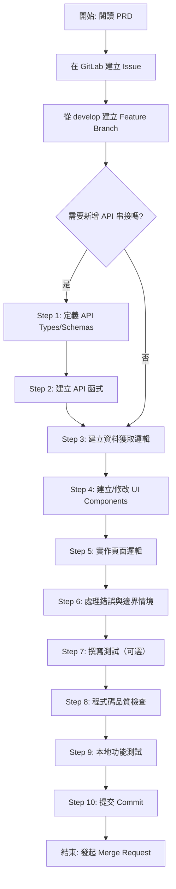

# 前端開發流程指南

本文件旨在引導開發者了解從接收需求到建立 GitLab Merge Request 的完整流程，包含開發注意事項、程式碼品質檢查，以及衝突處理方法。

---

## 目錄

1. [專案架構概覽](#1-專案架構概覽)
2. [開發環境設置](#2-開發環境設置)
3. [完整開發流程](#3-完整開發流程)
4. [Git 版控流程](#4-git-版控流程)
5. [Commit 與 Branch 規範](#5-commit-與-branch-規範)
6. [MR 發布流程與 SOP](#6-mr-發布流程與-sop)
7. [程式碼品質工具](#7-程式碼品質工具)
8. [GitLab CI/CD Pipeline](#8-gitlab-cicd-pipeline)
9. [衝突處理](#9-衝突處理)
10. [注意事項](#10-注意事項)
11. [常見問題 FAQ](#11-常見問題-faq)

---

## 1. 專案架構概覽

本指南適用於以下前端專案：

| 專案                      | Repository                  | 架構特性                           | 主要技術差異                      |
| ------------------------- | --------------------------- | ---------------------------------- | --------------------------------- |
| **前台系統** (User-side)  | `ai-training-partner`       | Static Export (`output: 'export'`) | Client Components + React Query   |
| **後台系統** (Admin-side) | `ai-training-partner-admin` | SSR (Server-Side Rendering)        | Server/Client Components 混合使用 |

### 共通技術棧

> ⚠️ **版本說明**：實際版本請參考各專案的 `package.json` 檔案。本指南適用於 `ai-training-partner` 與 `ai-training-partner-admin` 兩個專案，部分內容可能需依實際專案架構調整。

- **框架**：Next.js (App Router)
- **UI 函式庫**：React
- **語言**：TypeScript
- **樣式**：Tailwind CSS + shadcn/ui
- **程式碼品質**：ESLint + Prettier
- **版控**：GitLab（GitFlow 模式）

### 架構差異說明

#### 前台系統 (ai-training-partner)

**特性**：

- 使用 `output: 'export'` 輸出靜態檔案
- 大部分元件使用 `'use client'` 標記
- 使用 **React Query** 管理 API 呼叫與狀態
- 適合部署到靜態網站託管服務

#### 後台系統 (ai-training-partner-admin)

**特性**：

- 使用 SSR (Server-Side Rendering)
- Server Components 與 Client Components 混合使用
- **不使用 React Query**，Server Components 直接 `fetch` 資料
- 需要 Node.js 環境運行

---

## 2. 開發環境設置

開發環境的設置方式依各專案而異，請參考各專案的 README 文件進行設置。

**通常包含以下步驟**：

1. 安裝依賴
   `npm install`
2. 設置環境變數 .env.local 填入必要的環境變數，如有改變變數務必通知
3. 啟動開發伺服器
   `npm run dev`
4. 開啟瀏覽器測試 (http://localhost:3000)

詳細命令與配置請以各專案 README 為準。

---

## 3. 完整開發流程

### 開發流程圖



---

### Step 0: 前置準備

#### 1. 理解需求

仔細閱讀 PRD（產品需求文件）或 Issue 說明，確保你完全理解要開發的功能。

#### 2. 在 GitLab 建立 Issue

在 GitLab 上建立一個詳細的 Issue，描述要開發的功能或要修復的 Bug。這將是追蹤進度的主要依據。

#### 3. 與 PM 確認業務邏輯與 UI

- 確認功能流程與邊界情境
- 確認 UI 設計稿與互動細節
- 確認 API 規格（若需串接）

#### 4. 建立 Feature Branch

從 `develop` 分支建立新的 feature branch：

```bash
# 切換到 develop 分支並更新
git checkout develop
git pull origin develop

# 建立新的 feature branch
git checkout -b feature/{簡短描述}

# 範例：
git checkout -b feature/user-profile-page
git checkout -b feature/add-dark-mode
```

**分支命名規範：**

```
feature/{功能名稱}
fix/{修正項目}
refactor/{修正項目}
perf/{修正項目}
chore/{修正項目}

範例：
feature/dynamic-text-content-update
fix/fix-sticker-title-regex
chore/update-unity-editor
```

**已經 release 的版本快速修正，從 main 切新 Branch 出去：**

```
hotfix/{修正項目}

範例：
hotfix/update-ar-warning
```

---

### Step 1: 定義 API Types/Schemas（若需 API 串接）

若需要呼叫後端 API，先定義 TypeScript 型別：

```typescript
// lib/types/api.ts
type Course = {
  courseId: string;
  name: string;
  description: string;
  duration: number;
  image: string;
};

export type Courses = {
  totalPage: number;
  totalCount: number;
  courseList: Course[];
};
```

---

### Step 2: 建立 API 函式

在 `lib/data/` 或 `lib/api/` 目錄下建立 API 請求函式。

**重點**：

- 使用 TypeScript 定義完整的型別（參考 Step 1）
- 統一錯誤處理
- 導出為命名函式，方便測試與重用

**參考現有專案**：

- 前台系統：參考 `ai-training-partner/src/lib/data/` 目錄下的現有 API 函式
- 後台系統：參考 `ai-training-partner-admin` 專案中的 API 函式實作方式

---

### Step 3: 建立資料獲取邏輯

> ⚠️ **專案差異**：此步驟根據專案架構有不同的實作方式

#### 方案 A：前台系統 (ai-training-partner) - 使用 React Query

**適用情境**：Static Export 架構，需要在客戶端獲取資料

**實作位置**：`hooks/` 或 `lib/hooks/` 目錄

**重點**：

- 使用 `@tanstack/react-query` 的 `useQuery` 和 `useMutation`
- 設定合理的 `queryKey`（用於快取識別）
- 設定 `staleTime` 和 `gcTime`（快取時間）
- mutation 成功後使用 `invalidateQueries` 更新快取

**參考現有專案**：

- 前台系統：`ai-training-partner/src/hooks/` 目錄下的現有 hooks

#### 方案 B：後台系統 (ai-training-partner-admin) - 使用 Server Components 或傳統狀態管理

**適用情境**：SSR 架構，可在伺服器端或客戶端獲取資料

**實作方式**：

**選項 1：Server Components（推薦）**

- 直接在 Server Component 中使用 `fetch` 或 API 函式
- 資料在伺服器端獲取，減少客戶端負擔
- 無需額外的狀態管理

**選項 2：Client Components**

- 使用 `useState` + `useEffect` 管理狀態
- 適合需要互動性的元件

**參考現有專案**：

- 後台系統：`ai-training-partner-admin` 專案中的資料獲取模式

---

### Step 4: 建立/修改 UI Components

建立或修改可重用的 UI 元件。

**重點**：

- **優先使用既有元件**：檢查 `components/ui/` 是否已有可用的 shadcn/ui 元件
- **元件職責單一**：每個元件只負責一件事
- **完整的 TypeScript 型別**：定義 Props 介面
- **處理 Loading / Error / Empty 狀態**：確保所有情境都有對應的 UI

**標準元件結構**：

```
components/
├── ui/              # shadcn/ui 基礎元件（不要直接修改）
└── [feature]/       # 功能相關元件（如 user/, course/），例如可以再多個頁面複用
    └── [component].tsx

app/
└── [page]/              # 頁面路由
    └── [components]/    # 頁面元件，例如只在這個頁面使用
        └── [component].tsx
```

**參考現有專案**：

- 前台系統：`ai-training-partner/src/components/` 目錄
- 後台系統：`ai-training-partner-admin/src/components/` 目錄

---

### Step 5: 實作頁面邏輯

在 `app/` 目錄下實作頁面。

> ⚠️ **專案差異**：根據專案架構選擇 Server Component 或 Client Component

#### 前台系統 (ai-training-partner)

- 大部分頁面使用 **Client Components** (`'use client'`)
- 使用 React Query hooks 獲取資料
- 處理 Loading / Error / Empty 狀態

#### 後台系統 (ai-training-partner-admin)

- **優先使用 Server Components**（無需 `'use client'`）
- 直接在 Server Component 中 `await` 資料
- 需要互動性時才使用 Client Components

**重點**：

- **完整的錯誤處理**：必須處理 loading、error、empty 三種狀態
- **型別安全**：所有資料都有明確的 TypeScript 型別
- **使用既有元件**：整合 Step 4 建立的 UI 元件

**參考現有專案**：

- 前台系統：`ai-training-partner/src/app/` 目錄
- 後台系統：`ai-training-partner-admin/src/app/` 目錄

---

### Step 6: 處理錯誤與邊界情境

確保以下情境都有適當處理：

- ✅ **Loading State**：顯示載入中狀態（Skeleton 或 Spinner）
- ✅ **Error State**：顯示錯誤訊息或 fallback UI
- ✅ **Empty State**：資料為空時的顯示
- ✅ **Edge Cases**：空字串、null、undefined 的處理
- ✅ **網路錯誤**：API 呼叫失敗的處理
- ✅ **權限錯誤**：401/403 的處理與導頁

**重點**：

- 使用專案既有的 Loading / Error / Empty 元件
- 錯誤訊息對使用者友善（避免直接顯示技術錯誤）
- 考慮重試機制（React Query 的 `retry` 或手動重試按鈕）

**參考現有專案**：

- 前台系統：`ai-training-partner/src/components/` 中的錯誤處理元件
- 後台系統：`ai-training-partner-admin/src/components/` 中的錯誤處理元件

---

### Step 7: 撰寫測試（可選但建議）

若專案有測試需求，撰寫相關測試。

**測試類型**：

- **元件測試**：使用 `@testing-library/react` 測試 UI 元件
- **整合測試**：測試多個元件或頁面的互動
- **E2E 測試**：使用 Playwright 或 Cypress（若專案有設定）

**重點**：

- 測試關鍵業務邏輯與使用者流程
- 測試錯誤處理與邊界情境
- 保持測試簡單且可維護

**參考現有專案**：

- 檢查專案是否有 `__tests__/` 或 `*.test.tsx` 檔案
- 參考既有的測試寫法與測試工具設定

---

### Step 8: 程式碼品質檢查

提交前務必執行程式碼品質檢查：

1. 執行 ESLint 檢查
2. TypeScript 型別檢查
3. Prettier 格式化
4. 執行測試（若有）
5. 確認 build 成功

---

### Step 9: 本地功能測試

在本地環境完整測試功能：

- ✅ **正常流程**：功能運作正常
- ✅ **錯誤情境**：模擬 API 失敗、網路錯誤
- ✅ **邊界情境**：極端輸入、空資料
- ✅ **跨瀏覽器測試**：Chrome、Safari、Firefox（依需求）
- ✅ **響應式測試**：不同螢幕尺寸
- ✅ **重新整理測試**：重新載入頁面是否正常
- ✅ **返回上一頁測試**：瀏覽器返回行為是否正確

---

### Step 10: 提交 Commit

使用 **Conventional Commits** 規範撰寫 commit message。

詳細規範請見 [5. Commit 與 Branch 規範](#5-commit-與-branch-規範)。

```bash
git add .
git commit -m "feat: add user profile page with edit functionality"
```

---

## 4. Git 版控流程

### 基本流程

```bash
# 1. 創建 local branch
git checkout develop
git branch feature/my-feature
git checkout feature/my-feature

# 2. 新增修改的檔案到 staging area
git add [file name]

# 3. 將修改後的程式碼提交到 local repository
git commit -m "your commit message"

# 4. 如果 remote develop 分支在你分 branch 之後有新的 commit
# 請先將 remote develop 分支拉回 local，若無可以跳過此步驟
git checkout develop
git pull origin develop

# 5. 要先把 local 開發的 branch rebase 到 develop branch 最新的 commit 上
# 有可能需要解 conflict，請解完再 push 上去 GitLab
git checkout feature/my-feature
git rebase develop

# 6. 如果有 rebase develop（若無，可略過）
git push --force-with-lease origin feature/my-feature

# 7. 將本地的分支推到 GitLab
git push -u origin feature/my-feature
```

### ⚠️ 重要提醒

- 使用 `--force-with-lease` 而非 `--force`，避免覆蓋他人的 commit
- Rebase 前確保已 commit 所有變更
- 解 conflict 時仔細檢查，避免遺失程式碼

---

## 5. Commit 與 Branch 規範

### Commit 規格（請用英文寫）

要直接推上 `develop` 或發 MR，commit message 需符合以下規範：

```
{type}: {subject}

type: repo 更動的原因類型
  feat      – 新功能
  fix       – 修復
  refactor  – 重構
  perf      – 性能優化
  docs      – 文檔新增或更新 (README.md)
  style     – 代碼格式相關(對程式運行無影響的改變)
  test      – 測試相關新增或修改
  revert    – 回退到先前的 commit
  chore     – 不符合上述類型就歸到這吧 (例如更新依賴)

subject: 具體更動的主題
```

**範例：**

```bash
git commit -m "feat: add user authentication flow"
git commit -m "fix: resolve infinite loop in interview stage guard"
git commit -m "refactor: extract form validation logic to hook"
git commit -m "perf: optimize image loading with lazy loading"
git commit -m "docs: update README with new setup instructions"
git commit -m "chore: update Next.js to v14.1"
```

### Branch 規格

開發時一律從 `develop` 切新 Branch 出去，名稱規範如下：

```
feature/{功能名稱}
fix/{修正項目}
refactor/{修正項目}
perf/{修正項目}
chore/{修正項目}

範例：
feature/dynamic-text-content-update
fix/sticker-title-regex
chore/update-dependencies
```

已經 release 的版本快速修正，從 `main` 切新 Branch 出去：

```
hotfix/{修正項目}

範例：
hotfix/fix-auth-token-expiry
```

---

## 6. MR 發布流程與 SOP

### 6.1 MR 基本原則

#### **一個 MR 只圍繞一件事**

> 範例：
>
> - 處理了一個 issue
> - 解決了一個 bug
> - 新增了一個 component 或功能
> - 重構程式碼實現了某一個目的

#### **MR 範圍需明確且可獨立 review**

- ✅ **可接受**：小且單純的 API 串接可與 UI 修改放在同一個 MR
- ✅ **可接受**：若 API 還沒串接，先發純 UI 的 scope
- ❌ **避免**：若 MR 已可進行 review，不要等待 API 完成，建議先等待 merge，再另開後續 MR 處理 API 串接

#### **以功能為單位切分 MR**

一個 MR 僅涵蓋一個功能，例如：

- 登入 / 註冊功能 MR
- 後台面試者列表頁功能 MR
- 個人檔案編輯功能 MR

#### **避免在已進入 review 的 MR 中加入大型功能**

- ❌ **錯誤做法**：若 UI 已完成且已經進入 review，不要再 commit API implement 擴大修改範圍
- ✅ **正確做法**：應先完成並合併當前 MR，再開新 MR
- **理由**：可降低 review 風險與時間，並提升可讀性

#### **MR 已經進入 review 後，避免大幅功能變更**

- 否則會導致 reviewer 重複 review
- MR 變得過大、review 時間拉長
- 可能導致 reviewer 漏掉新加入的變更內容

#### **如果想要發出多個 MR 時，務必切分清楚範圍**

- ✅ **可同時發出**：MR1：A 頁面 UI、MR2：B 頁面 UI，兩者互不影響
- ⚠️ **注意**：
  - Reviewer 一次只會 review 並 merge 一個 MR
  - 若 MR 間有衝突，rebase 可能導致時程延誤

---

### 6.2 MR 建立與更新流程

#### MR 建立後若有「新增」或「更新」Commit

- **Bot 僅會在第一次建立 MR 時產生 description，且僅會比對這個 MR 的 diff**

  **!! 無論 repo 中有沒有 bot 自動生成 MR 描述，都應該自行檢查發出來的內容 !!**

- **任何時候 MR description 必須與最新程式碼一致**
  - 特別是測試情境、影片、截圖
  - 若有特定 scenario，需要自行補充與更新
- **任何 commit，都需手動更新 MR 說明**

- **可以 review 的時候，通知並且 assign reviewer**

#### 不需要合進 develop 的 MR

- 若 MR 已不再需要：
  - 請自行確認並關閉
  - 不要保留在 MR 清單中

---

### 6.3 完整 SOP (Create/Update MR)

#### 1. 業務邏輯與 UI

- 需與 PM 確認

#### 2. Branch

- `[source branch] → develop`
- 若已有 MR：
  - 先完成既有 MR，再開新的

#### 3. 通知與 Review 管理

**原則：**

- 尚未 resolve 的 MR ≠ 已完成
- Local demo ≠ 可 merge
- 未合進 develop/staging 即視為未完成

**若在 local 同步開發並要跟 PM demo：**

- 確保溝通仍有 MR 進行中
- 提供進行中的 MR 狀態、預估時程

**發 MR 者需主動掌控進度：**

- 通知 code review 前先確認所有 comment 已處理

  （overview 跟 changes 中所有 comment thread 均需在 thread 中回覆）

- 有新 commit 時需主動通知 reviewer
- 若持續有未合併 MR，需主動提醒 review 負責人

#### 4. SSG（Static Site Generation）輸出靜態檔案流程（ai-training-partner）

更新 static file output 流程時：

- 依測試步驟完整驗證
  - 輸出靜態檔案測試：https://gitlab.mpluscloud.com/ai/ai-training-partner/-/merge_requests/93
  - 說明文件：https://gitlab.mpluscloud.com/ai/ai-interview-docs/-/blob/main/frontend/STATIC_EXPORT_TESTING_EN.md
- 修正測試錯誤
- 在 Local 測試需附 demo 截圖 / GIF，並更新至 MR description

#### 5. Before merge：本地測試確認功能正常

#### 6. Merging

- 合併前確認 CI/CD pipeline 無錯誤

#### 7. After Merge

- local pull 最新 develop 測試

#### 8. 同樣規則適用於

- `mr: develop → staging`
- `mr: staging → main`
  - 每次上版後皆需確認 CI/CD pipeline 與環境正常

---

### 6.4 MR 必須包含的內容

```markdown
## Description

- Create an HTML file with simple texts in it and deploy to firebase.
- Add user authentication flow with JWT token.
- Implement responsive design for mobile devices.

## Test Plan

- Tested login flow on Chrome and Safari.
- Verified responsive layout on iPhone 13 and iPad.
- Confirmed error handling for invalid credentials.


## Related Issues(如有)

Closes #123
```

---

### 6.5 發布 MR 前的事前 Review（最低要求）

#### 1. 架構與寫法一致性

**導入新套件或新寫法前：**

- 確認是否與專案既有模式一致
  - state 管理、資料流、routing、redirect、error handling
- 避免同一專案同時存在多種做法（例如：同時混用不同 fetch / state pattern）
- 若必須引入新模式，需在 MR description 中說明原因與適用範圍
- 盡可能使用既有的 component 或套件（例如 shadcn），除非有特殊原因

**元件與資料責任需清楚：**

- Container / Page 不應混雜過多 business logic
- 避免在 UI component 中直接處理 API response 的轉換邏輯

#### 2. 程式碼品質與可維護性

- 移除不必要的 `console.log`、註解掉的舊程式碼、用不到的 function
- 避免不再需要使用的 hard-code（例如 API 串接前的 mock data）
- 檔案命名、資料夾結構需符合既有慣例
- 單一檔案過大（component / hook）時，需合理拆分

#### 3. 錯誤處理與邊界情境

**Error Handling**

- API error 不應只 console.error，需有對應 UI 或 fallback
- loading / error / empty state 需明確處理
- 避免假設 API 一定回傳正確格式

**Edge Case**

- 檢查空資料、異常資料、極端輸入
- 檢查重新整理、返回上一頁、重複操作的行為是否正確（例如 router.push || router.replace）

#### 4. Package 與依賴管理

**若更新 package：**

- 必須確認 build、lint、test 不受影響
- 需特別留意 breaking change（尤其是 major version）
- 不必要的 dependency 請避免引入

#### 5. 測試與驗證（對應 MR Review）

- MR 必須能被 reviewer 依 description 重現測試
- 測試情境需涵蓋：
  - 正常流程
  - 可能影響既有功能的情境
- 若為 UI / 流程修改：
  - 請附實際畫面截圖或操作影片（須確保 merge 後 app 正常）
  - 影片需與 MR 內容一致

---

### 6.6 常見風險與錯誤模式

#### 錯誤 1：尚未完成 MR，卻在 local 開發過大範圍

**潛在風險：**

- 架構或需求調整時，需反覆修改既有 MR
  - 建議優先完成並合併當前 MR
  - 避免後續大幅重工
- 協作風險
  - 他人無法得知 local 進度
  - 大量 conflict 要解決
  - 無法掌握 sprint 時程
  - 難以迭代交付成果

#### 錯誤 2：MR 測試影片不完整或與程式不一致

- 測試影片需與 MR 程式一致
- 必須涵蓋可能影響系統的完整情境
- 確保合併至 develop 不會影響既有功能
- 務必將測試情境錄影並附於 MR description

---

### 6.7 自檢表

請由團隊 leader 審查每次發布/更新 MR 時完成檢查，以下為至少應檢查的項目。

#### 協作開發原則

- [ ] 若 package 有必要更新，請測試確認專案是否影響
- [ ] 導入新的方法或套件，請先確認是否與既有的做法一致
- [ ] 確認此 MR 不與其他進行中的 MR 互相依賴
  - 不會 merge 上去，導致系統壞掉
- [ ] 避免在一個 MR 中引入無關 scope 的程式碼
- [ ] 是否確認 env 變數只存放必要資料

#### 發布 MR 前

- [ ] 發布 MR 時是否先 pull 最新的 develop 檢查在最新分支
- [ ] 如果 develop 有新推送，發布 MR 前/進行中，是否 rebase develop
- [ ] bot 生成的 MR description 是否無誤 / 若 bot 沒有生成（或專案沒有 bot webhook），應手動將必要的資訊放上
- [ ] 所有涉及的情境與流程的：demo 影片（GIF）、截圖、文字說明
- [ ] demo 影片或圖片的大小清楚
- [ ] demo 含有新增 / 轉導頁面，放上影片、截圖、url 路徑等相關說明
- [ ] description 的內容（demo 影片）與 MR 最新推送的程式碼一致
  - merge 上去後不會發生與 demo 影片不符合的狀況
  - 測試情境（scenario）、影片、截圖
- [ ] 確保該 MR 不會影響使用者測試，例如：
  - API 串接的 MR，確認與後端 API 上版的環境對齊
  - 使用staging環境API串接與測試(非開發用的local API)
  - mock data 模擬API串接前的資料
- [ ] 不必要的 console.log、程式碼、檔案刪除

**【SSG（Static Site Generation）：前台：ai-training-partner】**

以下的詳細請參考文件步驟執行

- [ ] 執行 next.js 中 `output: 'export'` 的方法
- [ ] `npm run build` 沒有衝突與錯誤
  - 若有錯誤，已解決後重新生成
- [ ] **（僅前台系統 ai-training-partner）** 生成 `/out` 靜態檔案
- [ ] **（僅前台系統 ai-training-partner）** `npm run preview:static`
- [ ] **（僅前台系統 ai-training-partner）** 提供靜態生成後的 demo 後在 local 的 demo 畫面
- [ ] **（僅前台系統 ai-training-partner）** 確認 static export 後的 routing 行為與原本一致

#### 發布 MR / MR 進行中

- [ ] CI/CD pipeline 沒有錯誤
- [ ] 通知 reviewer、assign reviewer
- [ ] 確保沒有閒置的 MR，若有，通知 reviewer 該 MR 需要 review

#### 更新 MR

- [ ] **上一階段的項目【發布 MR / MR 進行中】檢查項目均全部完成**
- [ ] 依據 comment 修改後 commit
- [ ] 確保在 overview、changes 的每一個 comment 都有回復
  - 不需修改的請回復原因
  - 直接修改的請回復已經調整
- [ ] 確定已經修改好全部的 comment，通知 reviewer 該 MR 需要 review

#### Merge MR 後

- [ ] CI/CD pipeline 沒有錯誤
- [ ] 通知團隊必要的「所有人」，已經推送到的環境
- [ ] 任何 merge，請自行在環境測試成功更新、沒有問題，例如：
  - 在 local 拉下 develop 測試
  - 合到 staging，請在 staging 環境測試；合到 main，請在 main 環境測試

---

## 7. 程式碼品質工具

⚠️ **重要提醒**

1. **具體檢查項依各專案設定為準**：每個專案的 `eslint.config.js` 或 `.eslintrc.json` 可能有不同的 linter 規則配置，請以專案設定為準
2. **本地必須通過 linter 檢查才可發 MR**：在發起 Merge Request 之前，務必確保本地已通過所有 linter 檢查，否則 CI/CD Pipeline 會失敗

### 7.1 ESLint - 程式碼檢查

ESLint 用於捕捉 JavaScript/TypeScript 程式碼品質問題。

#### 常見問題與解決

| 規則代碼                           | 說明                   | 解決方式                        |
| ---------------------------------- | ---------------------- | ------------------------------- |
| @typescript-eslint/no-unused-vars  | 未使用的變數           | 移除未使用的變數或使用 `_` 前綴 |
| react-hooks/exhaustive-deps        | useEffect 依賴項不完整 | 補充缺少的依賴項                |
| @next/next/no-html-link-for-pages  | 應使用 Next.js Link    | 將 `<a>` 改為 `<Link>`          |
| @typescript-eslint/no-explicit-any | 使用 any 型別          | 定義明確的型別                  |

### 7.2 Prettier - 程式碼格式化

Prettier 自動格式化程式碼，確保風格一致。

#### 配置

Prettier 配置在 `.prettierrc` 或 `package.json`：

```json
{
  "semi": true,
  "trailingComma": "es5",
  "singleQuote": true,
  "printWidth": 100,
  "tabWidth": 2
}
```

**參考現有專案**：查看專案中既有的錯誤處理模式

---

## 8. GitLab CI/CD Pipeline

> ⚠️ **重要**：實際的 CI/CD 配置依各專案而異，請參考專案根目錄的 `.gitlab-ci.yml` 檔案。以下說明以 `ai-training-partner` 專案為例。

### 8.1 Pipeline 觸發時機

Pipeline 會在以下情況自動執行：

| 觸發條件                              | 說明                          | 執行的 Stage                    |
| ------------------------------------- | ----------------------------- | ------------------------------- |
| **Push 到 main/develop/staging 分支** | 直接推送到主要分支            | deploy_test                     |
| **Merge Request**                     | 建立或更新 MR                 | deploy_test                     |
| **Feature 分支變更**                  | `src/` 或 `package.json` 變更 | deploy_test                     |
| **Push 到 staging 分支**              | 部署到 staging 環境           | deploy_test + deploy_staging    |
| **Push 到 main 分支**                 | 部署到 production 環境        | deploy_test + deploy_production |

### 8.2 檢查項目

| Stage       | Job               | 說明                                                  |
| ----------- | ----------------- | ----------------------------------------------------- |
| deploy_test | build-and-start   | 執行 npm install → npm run build → npm run start 測試 |
| deploy      | deploy_staging    | 部署到 staging 環境（僅 staging 分支）                |
| deploy      | deploy_production | 部署到 production 環境（僅 main 分支）                |

⚠️ **注意**：

- 本專案使用 Static Export (`output: 'export'`)，build 後會生成 `/out` 靜態檔案
- CI/CD 目前使用 `npm run start` 測試，實際部署需根據各專案環境調整
- Lint、Type Check 等品質檢查建議在本地執行（參考第 7 章）

### 8.3 Pipeline 失敗處理

#### 1. 查看錯誤訊息

在 GitLab 的 Pipeline 頁面點擊失敗的 Job，查看詳細錯誤訊息。

#### 2. 常見失敗原因與解決方式

| 失敗原因               | 解決方式                                                   |
| ---------------------- | ---------------------------------------------------------- |
| **npm install 失敗**   | 檢查 `package.json` 是否有錯誤，本地執行 `npm ci` 測試     |
| **npm run build 失敗** | 本地執行 `npm run build`，修復 TypeScript 錯誤或 Lint 錯誤 |
| **應用啟動失敗**       | 檢查是否缺少環境變數，確認 `next.config.mjs` 配置正確      |
| **部署服務器連接失敗** | 檢查 SSH 配置與服務器狀態（需聯繫維運人員）                |

#### 3. 本地修復步驟

- 1. 執行品質檢查
- 2. 確認 build 成功
- 3. 測試應用啟動（SSR 專案）
- 4. 或測試靜態檔案生成（Static Export 專案）

#### 4. 重新提交

```bash
git add .
git commit -m "fix: resolve build issues"
git push -u origin [your-branch]
```

### 8.4 品質檢查建議

⚠️ **注意**：目前 CI/CD 未包含獨立的 Lint、Type Check、Test jobs、Prettier。建議在本地開發時執行以下檢查：

---

## 9. 衝突處理

### 9.1 Git 衝突處理

#### 解決衝突步驟

1. **同步遠端分支**

   ```bash
   git checkout develop
   git pull origin develop
   ```

2. **Rebase 到 develop**

   ```bash
   git checkout [your-branch]
   git rebase develop
   ```

3. **如果出現衝突，解決它們**
   - 打開衝突的檔案
   - 找到 `<<<<<<<`, `=======`, `>>>>>>>` 標記
   - 選擇保留的程式碼，移除標記
   - 暫存修改：`git add .`

4. **繼續 rebase**

   ```bash
   git rebase --continue
   ```

5. **推送更新**

   ```bash
   git push --force-with-lease origin [your-feature]
   ```

---

### 9.2 Package.json 衝突處理

在多人協作開發過程中，當多個開發者同時修改 `package.json` 時，容易產生版控衝突。

1. **頻繁同步**
   - 開發過程中定期同步 develop branch

2. **團隊協調**
   - 在新增套件前檢查是否有其他人也在修改依賴
   - 通知團隊成員你正在更新套件

---

## 10. 注意事項

### 10.1 錯誤處理規範

在元件或 API 呼叫中，必須妥善處理可預期的錯誤。

**重點**：

- ✅ **必須處理 Loading State**：顯示載入中指示器
- ✅ **必須處理 Error State**：顯示錯誤訊息或 fallback UI
- ✅ **必須處理 Empty State**：資料為空時的顯示
- ❌ **不可假設資料一定存在**：可能導致 runtime error

**實作方式根據專案架構而異**：

- **前台系統**：使用 React Query 的 `isLoading`、`isError`、`error` 狀態
- **後台系統**：使用 Server Components 的 `loading.tsx`、`error.tsx`，或在 Client Components 中使用 `useState` + `useEffect`

**參考現有專案**：查看專案中既有的錯誤處理模式

### 10.2 效能優化注意事項

**通用優化**：

- **圖片優化**：使用 Next.js `<Image>` 元件（自動優化、lazy loading）
- **Code Splitting**：使用 `dynamic()` 延遲載入大型元件
- **避免不必要的 re-render**：適當使用 `useMemo`、`useCallback`、`React.memo`
- **Bundle 大小控制**：避免引入不必要的大型套件

**前台系統特定（ai-training-partner）**：

- **React Query 快取**：適當設定 `staleTime` 和 `gcTime` 減少 API 呼叫
- **Static Export 優化**：確保靜態頁面生成正確

**後台系統特定（ai-training-partner-admin）**：

- **Server Components 優先**：減少客戶端 JavaScript
- **Streaming SSR**：使用 `loading.tsx` 提供更好的載入體驗

**參考現有專案**：查看專案中既有的效能優化實踐

### 10.3 安全性注意事項

- **環境變數**：敏感資訊使用環境變數，不要 hard-code
- **XSS 防護**：避免使用 `dangerouslySetInnerHTML`，若必須使用，需先 sanitize
- **Token 儲存**：避免將 JWT token 存放在 localStorage（參考資安規範）
- **API 金鑰**：前端不要暴露後端 API 金鑰，使用 Server Components 或 API Routes

```typescript
// ❌ 錯誤做法：將敏感資訊 hard-code
const API_KEY = 'sk-1234567890abcdef';

// ✅ 正確做法：使用環境變數
const API_KEY = process.env.NEXT_PUBLIC_API_KEY;

// ❌ 錯誤做法：XSS 風險
<div dangerouslySetInnerHTML={{ __html: userInput }} />

// ✅ 正確做法：使用安全的 sanitizer
import DOMPurify from 'dompurify';
<div dangerouslySetInnerHTML={{ __html: DOMPurify.sanitize(userInput) }} />
```

### 10.4 程式碼風格

- **保持一致性**：參考專案中現有的程式碼，模仿其命名、結構和註解風格
- **命名規範**：
  - 元件名稱：`PascalCase`（如 `UserProfileCard`）
  - 函式/變數：`camelCase`（如 `getUserProfile`）
  - 常數：`UPPER_SNAKE_CASE`（如 `MAX_RETRIES`）
  - 檔案名稱：元件使用 `kebab-case.ts`

---

## 11. 常見問題 FAQ

### Q1: TypeScript 型別錯誤怎麼辦？

**A:**

1. **避免使用 `any`**：定義明確的型別或介面
2. **使用型別推導**：讓 TypeScript 自動推導回傳型別
3. **參考現有專案**：查看專案中類似的型別定義方式

### Q2: Next.js build 失敗怎麼辦？

**A:** 常見原因和解決方式：

1. **型別錯誤**

2. **環境變數缺失**

   ```bash
   # 確認 .env.local 是否包含必要變數
   # 確認 next.config.js 、 env.mjs 中是否正確配置
   ```

3. **套件版本衝突**

### Q3: React Query 快取問題怎麼處理？（僅前台系統 ai-training-partner）

**A:**

使用 `useQueryClient` 手動管理快取：

- `invalidateQueries`：使特定 query 失效並重新獲取
- `removeQueries`：清除特定 query 的快取
- `clear()`：清除所有快取

**參考**：[React Query 文件 - Query Invalidation](https://tanstack.com/query/latest/docs/react/guides/query-invalidation)

### Q4: 如何測試 Static Export？（僅前台系統 ai-training-partner）

**A:**

1. **將 next.config.mjs 中的註解暫時解除**

```bash
# 用於靜態導出測試
  output: 'export',
  trailingSlash: true,
```

2. **生成靜態檔案與測試**

```bash
# 1. 執行 build（生成靜態檔案到 /out 目錄）
npm run build

# 2. 預覽靜態檔案
npm run preview:static

# 3. 測試所有路由是否正常
# 4. 確認 routing 行為與預期一致
```

---

## 相關文件

- [Next.js 官方文件](https://nextjs.org/docs)
- [React 官方文件](https://react.dev/)
- [TypeScript 官方文件](https://www.typescriptlang.org/docs/)
- [React Query 官方文件](https://tanstack.com/query/latest/docs/react/overview)
- [ESLint 官方文件](https://eslint.org/docs/latest/)
- [Prettier 官方文件](https://prettier.io/docs/en/)
- [Conventional Commits](https://www.conventionalcommits.org/)
- [shadcn/ui 文件](https://ui.shadcn.com/)

---

_最後更新：2026-01-15_
